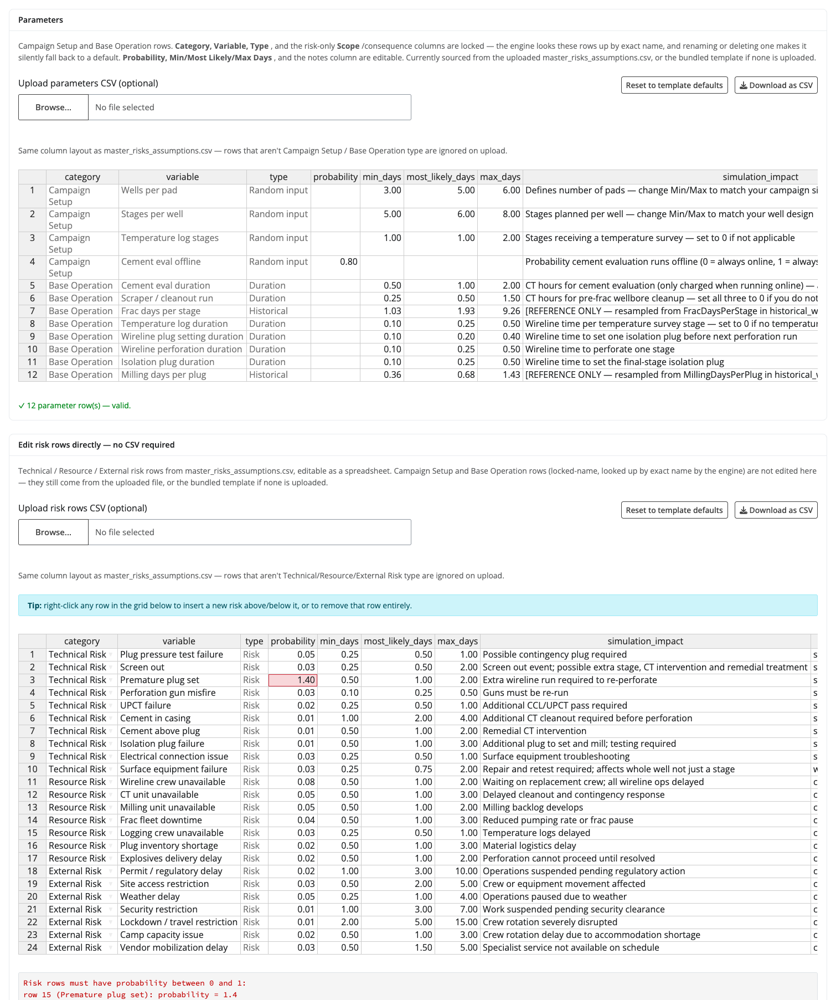
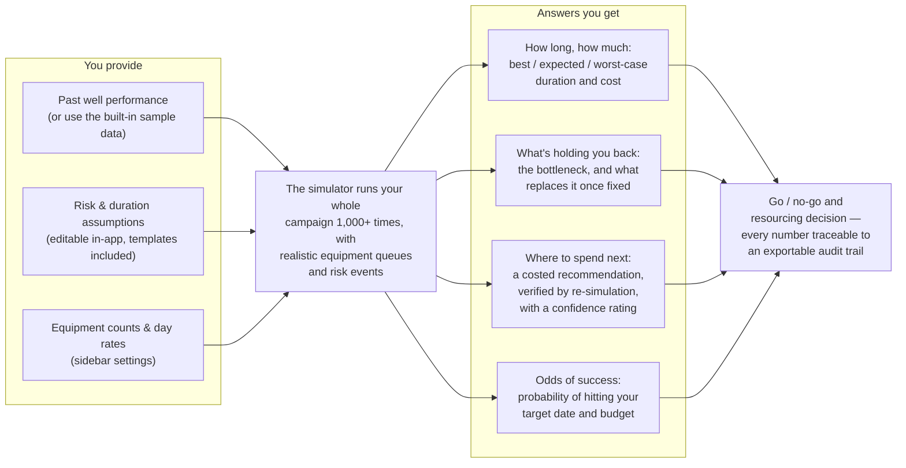

# Frac Campaign Planning Simulator

A Shiny application for planning and evaluating multi-pad hydraulic fracturing campaigns using Monte Carlo simulation, operational risk modelling with consequence propagation, resource-constrained discrete scheduling, Bayesian calibration, and scenario optimisation.

The simulator is designed for completion engineers, project managers, and operations teams who need to estimate campaign duration, assess uncertainty, evaluate zipper frac strategies, quantify the impact of additional resources, and identify the most cost-effective execution configuration before field operations begin.

The user does not need to edit R code. The application reads CSV input files, runs simulations, generates audit trails, and exports executive planning reports.

**Reading guide** — this README covers, in order:
[the problem](#project-overview) ·
[architecture](#architecture) (with [detailed subsystem diagrams](docs/architecture.md)) ·
[workflow / operational logic](#operational-logic) ·
[key algorithms](#key-algorithms) ·
[screenshots](#screenshots) ·
[a 5-minute demo](#quick-demo-no-data-required) ·
plus [input file formats](#input-files), [outputs](#outputs), the
[roadmap](#roadmap), and [limitations](#limitations).

---

# Current Validation Status

Checked at commit `0e8a2ac` (post engine-module split; original stable checkpoint tagged [`v16-stable-checkpoint`](../../tree/v16-stable-checkpoint)), 2026-07-10. Re-run these yourself with the commands shown — none of this is asserted from memory.

| Check | Command | Result |
|---|---|---|
| Engine regression (fast engine bit-identical to archive engine) | `Rscript R/check_regression.R` | ✅ PASS — summary / resource_utilization / well_details / risk_event_log / optimiser scores all IDENTICAL |
| Property-check test suite | `for f in R/test_*.R; do Rscript "$f"; done` | ✅ 15 / 15 scripts PASS |
| Dependency check (DESCRIPTION Imports) | `source("run_local.R")` / manual check against `installed.packages()` | ✅ 19 / 19 required packages present, 0 missing |
| App build (UI tree + server function construct without error) | Parse `app/app.R` excluding the final `shinyApp()` call and `eval()` every expression | ✅ UI is a valid `bslib_page`; `server` is a function |

The architecture-cleanup pass this table originally guarded (splitting the 4,114-line engine file into four modules, [plan](docs/architecture_cleanup_plan.md)) has since landed — every check above was re-run and stayed green across it, as intended, because the split moved code verbatim without touching simulation logic.

---

# Project Overview

Frac campaigns are complex operations involving multiple wells, multiple pads, shared resources, operational uncertainty, and competing schedules.

Traditional planning approaches often rely on deterministic durations and engineering judgment, making it difficult to quantify schedule uncertainty or evaluate alternative execution strategies.

This project provides a data-driven framework for:

- Campaign duration forecasting (P10 / P50 / P90)
- Operational risk assessment with consequence propagation
- Resource planning and bottleneck detection
- Zipper frac evaluation, including frac tree constraints
- Campaign acceleration and investment ranking
- Constraint cascade analysis (sequential bottleneck resolution)
- Automated optimum-scenario search (Pareto frontier)
- Probability of meeting a target completion date or staying within a budget ceiling
- Traceable, re-simulation-verified recommendations with an auto-generated management narrative
- Bayesian updating of durations and risk probabilities from new campaign data
- Automated distribution fitting and assumption calibration from historical wells
- Decision support before execution

---

# Main Features

## Campaign Planning
- Conventional and zipper frac simulation, side-by-side comparison with a common seed
- Multi-pad campaigns, 20 to 40 wells, randomised pad allocation and stage counts
- Frac tree constraint modelling (swap delays with 2 trees, diminishing benefit at 3 and 4+)
- Execution modes: Fast (300 runs), Standard (1,000), Audit (2,000 with full traceability)

## Resource Modelling — Five Distinct Resources
The model tracks five resources independently. Each has its own unit count, workload calculation, utilization metric, and bottleneck detection:

| Resource | Sidebar label | What it represents | Primary activities |
|---|---|---|---|
| **Frac fleet** | Frac fleets | Pumping spread (blenders, pump trucks, treating iron) | Stage execution, pressure testing |
| **Wireline** | Wireline units | Wireline unit (truck, depth control, toolstring) | Perforation, plug setting, temperature logs |
| **CT / cleanout** | CT / cleanout units | Light coiled tubing unit for well intervention | Pre-frac cleanout runs, cement evaluation support, screenout response, premature plug remediation |
| **Milling** | Milling units | Dedicated plug-milling spread (PDM motor + mill BHA) | Post-frac plug drill-out |
| **Testing unit** | Testing units | Wellhead flowback and well test equipment | Post-milling flowback, pressure build-up test |

> **CT / cleanout vs Milling — these are different units.** The "CT / cleanout" resource is the light well intervention CT string used for pre-frac wellbore cleanup and risk interventions (screenout clean-up, premature plug response). It is **not** the drill-out spread. Milling (plug drill-out) is a separate resource using a PDM motor and mill BHA on a dedicated workstring or CT milling unit. If your operation uses the same CT string for both cleanout and milling, model this using the "Allow CT units to support milling" option in the sidebar, which transfers spare CT capacity to the milling workload at a configurable efficiency (default 0.65).

## Risk Modelling
- Full plug-and-perf risk library: plug pressure test failure, screenout, premature plug set, perforation misfire, UPCT failure, cement in casing, cement above plug, isolation plug failure, plus resource and external risks
- **Risk scope calibration**: risks are classified as `stage` (probability per stage, e.g. screenout), `well` (per well independently), or `campaign` (single event for whole campaign, e.g. crew unavailability). This prevents the common error of treating crew absences as 30 independent per-well events
- **Consequence propagation**: each technical risk cascades into induced workload (wireline re-runs, CT interventions, extra milling plugs, testing interventions, extra pumping) rather than a direct delay only
- **Schedule risk heatmap**: well × risk-event tile chart showing expected delay contribution per well, plus a well risk ranking bar chart and a Low / Medium / High / Critical classification per well (quartile-based)
- All consequence values overridable per-risk from the assumptions CSV

## Analytics & Learning
- **Historical Learning Engine**: automatically fits Normal, Lognormal, Gamma, and Weibull distributions to `FracDaysPerStage` and `MillingDaysPerPlug` from historical wells; ranks fits by AIC/BIC/KS test; outputs a suggested min/mode/max table ready to paste into the assumptions CSV
- **Sensitivity Analysis Engine**: one-at-a-time (OAT) ±20% sweep over all timing and scalar parameters, ±50% over risk event probabilities, and ±1 unit over resource counts; butterfly tornado chart ranked by P50 swing; mode-split grouped bar for Conventional vs Zipper comparison
- **Bayesian Duration Updater**: Normal-Normal conjugate updating of `FracDaysPerStage` and `MillingDaysPerPlug` as new completed wells arrive; shows prior vs posterior distributions and 90% CI on the update. Beta-Binomial updating of risk event probabilities from observed event counts. Updated merged dataset flows back into the next simulation run
- **What-If Scenario Builder**: define named override variants (e.g. add a frac fleet, change stages, change zipper efficiency) and compare all variants in a single batch run; P10/P50/P90 bars with error bars, S-curve overlay, readiness score and bottleneck per variant

## Decision Support
- Executive KPI dashboard with readiness score and its drivers
- **Decision support tab** — a single consolidated view for go/no-go decisions:
  - **Management summary**: an auto-generated narrative paragraph stitching together the recommendation, the current bottleneck, and the risk/uncertainty outlook into one management-readable statement
  - **Recommendation panel**: an evidence-based "why" panel for the top resource addition (current utilization, bottleneck status, days saved, incremental cost, ROI), with a **"Verify by re-simulation"** button that re-runs the simulation to confirm the instant analytic estimate, and a **confidence badge** (High / Moderate / Low / Inconclusive) that folds statistical win-rate together with OAT robustness stability
  - **Risk prediction table**: per-risk probability of occurrence, expected delay, P90 delay, and likelihood/impact rating, optionally evaluated against a target completion date
  - **Uncertainty table**: P10/P50/P90 by mode plus probability of finishing by a target date, probability of staying within a budget ceiling, probability of resource overload, and P50 cost
  - **Constraint-relief cascade**: ranked list of which resource to relieve next and the cumulative days each successive fix recovers
  - **Recommendation robustness check**: one-at-a-time (OAT) ±15% sweep over every planning assumption; reports whether the recommendation flips under any perturbation; combined best-case / stress-case bundle shows the full planning envelope
  - **Assumption sensitivity tornado chart**: diverging horizontal bar chart showing the P50 schedule impact of each assumption swing, ranked by magnitude, coloured by direction (saves days / adds days)
  - **Scenario library**: save any run configuration with a label, compare saved scenarios side-by-side in a summary table; export the library to a .json file and re-import it in a future session to restore all saved scenarios including duration distributions
- Investment ranking: net benefit and ROI (days per $1M) of each proposed resource addition
- **Constraint cascade analyser** (Optimiser tab): greedy sequential bottleneck resolution — answers what limits you now, what limits you after you fix it, and where each additional dollar generates the most schedule return, with a waterfall chart of P50 duration after each fix
- **Scenario optimiser**: grid search over resource configurations, common-random-number screening, Pareto frontier of duration vs total mobilisation cost, one-click apply of the recommended scenario
- Optional **target duration** and **budget ceiling** sidebar inputs feed the risk prediction and uncertainty tables above

## Audit and Reporting
- Executive PDF report (landscape, KPI dashboard, charts, styled tables, deployment timeline), with a prepended **Executive Decision Summary** page (management narrative, recommendation with combined confidence level, bottleneck evidence, risk/uncertainty outlook)
- Conditional **Robustness & Scenario** page appended to the PDF when a robustness check or scenario comparison has been run: includes the OAT stability table, assumption sensitivity tornado chart, and (if scenarios were saved) a scenario comparison table
- Well-level audit trail, risk event log with consequence columns, assumptions-used table
- Downloadable audit package (zip) with 18+ CSV exports
- Input fidelity check: simulated vs historical distributions

# Decision-Support Methodology

This app exists to answer one recurring planning question: **given current resources, risk
assumptions, and historical performance, what is the best next move on a frac campaign — and
how confident should you be in it?** The sections below explain how each layer of the model
feeds that answer.

**Planning problem.** Completion engineers and project managers need to decide things like:
which execution mode to run (conventional vs zipper), how many of each resource to mobilise,
whether an extra unit is worth its day rate, and whether new field data should change the plan.
These are commercial and operational decisions, not modelling exercises — every feature in this
app is built to move one of those decisions forward.

**Simulation approach.** A Monte Carlo engine draws stage/plug durations and risk events from
historical-well-calibrated (or synthetic, if no history is supplied) distributions and runs the
full campaign hundreds to thousands of times, producing a P10/P50/P90 duration distribution per
operation mode rather than a single point estimate.

**Resource-constrained scheduling.** Each simulated run schedules frac, wireline, CT/cleanout,
milling, and testing units against the well sequence under the chosen execution mode, so
duration reflects actual equipment contention and hand-off delays, not just summed task time.

**Bottleneck detection.** Per-resource P90 utilization is tracked across all simulated runs;
the resource closest to saturation is flagged as the binding constraint, with a cascade showing
what becomes the new constraint once the current one is relieved.

**Recommendation logic.** `recommend_action()` proposes adding one unit of the binding resource,
then verifies the claim by re-running the simulation with that unit added (same random seed,
paired comparison) rather than relying on an analytic estimate alone. The output reports the
recommendation, the evidence behind it, expected P50 and economic impact, a confidence level
from the paired win-rate, and a three-way verdict — **Recommended**, **Optional**, or
**Not justified** — so a reviewer can tell at a glance whether the schedule saving actually
covers the added cost with enough statistical confidence to act on.

**Uncertainty handling.** Sensitivity analysis stress-tests timing assumptions (±20%), risk
probabilities (±50%), and resource counts (±1 unit) at reduced iteration counts to rank which
assumptions matter most; a recommendation robustness check separately re-tests whether the
chosen action still holds under ±15% planning-assumption swings. Both are screening tools —
final decisions should be confirmed with a full-iteration simulation run.

**Historical learning.** As new completed wells and risk observations come in, a Bayesian
updater combines them with the historical prior (Normal-conjugate for durations,
Beta-Binomial for risk probabilities) and reports whether assumptions are Stable, Increasing,
or Decreasing, and how strong the supporting evidence is, before any planning numbers change.

**Limitations.** This is a planning-level model, not a drilling/completions engineering
simulator: cost rates, risk probabilities, and duration distributions are only as good as the
assumptions CSV and historical data supplied. Resource scheduling assumes units are
interchangeable within a class. Recommendations should be reviewed by an engineer familiar with
the specific pad layout, contracts, and field conditions before being acted on.

# AI-Assisted Development Note

AI-assisted development tools were used to accelerate the implementation of this application —
writing and refactoring R/Shiny code, generating test scaffolding, and drafting documentation.
The operational model, engineering assumptions, workflow logic, and validation review were
directed by the project owner based on completion and well intervention experience. AI tooling
did not originate the domain logic; it implemented decisions specified and reviewed by the
project owner.

---

# Screenshots

*Curated for completion engineers and project managers — executive summary, decision
tradeoffs, operational risk, resource bottlenecks, and cost/schedule optimization. For
the full tab-by-tab set (Workflow reference, Historical Learning, Sensitivity, Bayesian
Update, What-If, Risk Heatmap), see `docs/images/screenshots/`.*

*Last refreshed: 2026-07-09 (commit `fe35c4c`). UI labels and panels can drift out of sync
with these images between refreshes — if something below doesn't match the running app,
trust the app and regenerate via `Rscript generate_screenshots.R` and
`Rscript generate_screenshots_tabs.R`.*

### Overview — KPI dashboard


### Decision support — narrative, recommendation, robustness and scenario library


### Risks — schedule risk heatmap and well risk ranking


### Resources — utilization and deployment


### Optimiser — constraint cascade and Pareto search


### Risk Editor — in-app editable grids, no CSV authoring required


---

# Operational Logic

How the model maps to real operations: the equipment relationship map, conventional
and zipper execution logic (with timing diagrams), risk consequence propagation, the
campaign duration formula, and a table for adapting the model to operations that
differ from the defaults.

**Full reference: [`docs/operational_logic.md`](docs/operational_logic.md).** The
in-app Workflow tab shows the same operational sequence live, against your current
configuration.


---

# Architecture

## At a glance

What goes in, what the simulator does, and what decisions come out — in
plain language. (Engineers: the technical system diagram and the five
detailed subsystem diagrams are in
[`docs/architecture.md`](docs/architecture.md).)



Three properties matter most for trusting the output: recommendations are
**verified** (re-simulated with the proposed change, not just estimated),
uncertainty is **explicit** (ranges and probabilities, never single-point
answers), and everything is **auditable** (each figure exports to an audit
package a reviewer can check).

## Under the hood

The technical system diagram and five detailed subsystem diagrams
(simulation pipeline, historical learning, recommendation engine, resource
scheduler, risk propagation) are in
[`docs/architecture.md`](docs/architecture.md). The table below maps each
file to its role.

### Code map

| File | Role |
|---|---|
| `app/app.R` | Shiny UI + server: 14 tabs, async run via `future::multisession`, download handlers |
| `R/engine_core.R` | The Monte Carlo engine: sampling, risk grid, both resource schedulers, `simulate_campaign_detailed()` |
| `R/summaries.R` | Post-processing of a completed run into UI-ready tables (readiness, KPIs, cost, timeline, zipper breakdown) |
| `R/report_pdf.R` | PDF management report renderer (gridExtra/grDevices, isolated side effects) |
| `R/optimiser_cascade.R` | Grid-search optimiser + greedy constraint cascade (multi-run orchestration) |
| `R/optimiser_parallel.R` | Parallel backend for the optimiser (bit-identical to sequential; CRN) |
| `R/recommendations.R`, `R/bottleneck_explain.R` | Traceable recommendation verdicts; queue-delay bottleneck ranking |
| `R/learning_engine.R`, `R/bayesian_updater.R` | Distribution fitting (AIC-ranked); Normal-conjugate + Beta-Binomial updating |
| `R/risk_library_engine.R` | Scope-aware risk table + consequence-library wiring |
| `R/sensitivity_analysis.R`, `R/robustness.R`, `R/whatif_builder.R`, `R/risk_uncertainty.R`, `R/risk_heatmap.R`, `R/scenario_library.R`, `R/narrative_engine.R` | One decision-support feature each |
| `R/constants.R`, `R/load_inputs.R`, `R/validate_inputs.R`, `R/validate_risk_consequence_library.R` | Shared constants; CSV loading and validation |
| `R/plots.R` | All ggplot chart builders |
| `R/check_regression.R`, `R/check_scheduling_modes.R`, `R/test_*.R` | Regression oracle (vs `R/archive/`) + 15 property-check suites, run in CI |

---

# Key Algorithms

The load-bearing methods, what they actually do, and where they live. Wording
here is deliberately calibrated — where a method is a screening estimate or an
approximation, it says so.

| Algorithm | What it does | Where |
|---|---|---|
| **Bootstrap + triangular sampling** | Stage/plug durations are bootstrap-resampled from historical wells; assumption-driven durations and risk delays are triangular(min, most-likely, max) draws | `triangle_sample()`, `simulate_campaign_detailed()` — `R/engine_core.R` |
| **Scope-aware risk probability** | A per-*stage* probability compounds to `1−(1−p·m)^stages` per well (multiplier applied per stage, *before* compounding); per-*well* applies independently; per-*campaign* is a single Bernoulli draw. Prevents treating one campaign-level event as 30 independent per-well events | `build_risk_table()` — `R/risk_library_engine.R` |
| **Consequence propagation** | Each occurred technical risk adds direct delay *and* induced workload (extra wireline runs, CT days, milling plugs, testing days, stages, logistics) onto the specific resource that absorbs it | `draw_risks_on_grid()`, `CONSEQUENCE_CONFIG` — `R/engine_core.R` |
| **Event-mode resource scheduling** | Pre-frac: earliest-available-unit assignment across the wireline pool with CT gating, producing a wait *attribution* (capacity vs CT-caused; queueing vs duration-floor). Post-frac: first-come-first-served milling/testing. A contention model, not a calendar-resolution discrete-event simulation | `schedule_pre_frac()`, `schedule_post_frac_milling()` — `R/engine_core.R` |
| **Common random numbers (CRN)** | Every mode/scenario comparison runs on the same seed, so deltas are paired comparisons with variance reduction — Conventional-vs-Zipper, the optimiser grid, and recommendation verification all use it | seeding in `simulate_campaign_detailed()`; used by `app/app.R`, `R/optimiser_cascade.R`, `R/recommendations.R` |
| **Re-simulation-verified recommendations** | The default recommendation is an instant analytic estimate; "Verify" re-runs the full simulation with +1 unit at the same seed and measures the actual paired P50 reduction and win rate, then applies economic + confidence gates for a Recommended / Optional / Not justified verdict | `recommend_action()`, `REC_DECISION_THRESHOLDS` — `R/recommendations.R` |
| **AIC-ranked distribution fitting** | MLE fits (Normal/Lognormal/Gamma/Weibull) ranked by AIC — the selection logic. The KS p-value shown alongside is an *indicative* check only (parameters were fitted from the same data), never a confirmed-fit claim | `learn_from_historical()` — `R/learning_engine.R` |
| **Bayesian updating** | Durations: Normal-conjugate, precision-weighted prior/new-data combination with a 90% CI on the shift. Risk probabilities: Beta-Binomial with a user-set prior strength. Conservative decision thresholds gate any "update the assumption" call | `R/bayesian_updater.R`, `BAYES_DECISION_THRESHOLDS` |
| **Greedy constraint cascade** | Fix the binding constraint, re-simulate, find the next one — repeated until marginal saving < 2 days. Greedy, not globally optimal; the Pareto grid search covers non-obvious multi-resource combinations | `analyse_constraint_cascade()`, `optimise_campaign_scenarios()` — `R/optimiser_cascade.R` |
| **OAT sensitivity / robustness** | One-at-a-time perturbation sweeps (±20% timing, ±50% risk probability, ±1 resource unit; ±15% for recommendation robustness) at reduced iterations — screening tools for ranking drivers, not calibrated confidence intervals | `R/sensitivity_analysis.R`, `R/robustness.R` |

Each is diagrammed in [`docs/architecture.md`](docs/architecture.md).

---

# Application Guide

| Tab | Contents |
|---|---|
| **Overview** | KPI value boxes (best option, P50/P90, zipper saving, readiness + drivers, bottleneck, idle cost), investment ranking, S-curve, distribution, traffic lights |
| **Decision support** | Management summary narrative, recommendation panel with "Verify by re-simulation", risk prediction table, uncertainty (P-values) table, constraint-relief cascade, robustness check, sensitivity tornado, scenario library (with export/import for cross-session persistence) |
| **Historical Learning** | Automatic distribution fitting (Normal / Lognormal / Gamma / Weibull) to FracDaysPerStage and MillingDaysPerPlug; AIC/BIC/KS ranking; density overlay; Q-Q plot; suggested assumptions table |
| **Sensitivity** | OAT ±20% sweep (timing, scalars), ±50% (risk probabilities), ±1 unit (resources); tornado ranked by P50 swing; Conventional vs Zipper mode comparison grouped bar |
| **Bayesian Update** | Upload new completed-well observations; Normal-Normal conjugate duration update with prior vs posterior density overlay; Beta-Binomial risk probability update; merged dataset fed back to next simulation |
| **What-If** | Define named variants (resource counts, timing, efficiency overrides); P10/P50/P90 bar chart with error bars; S-curve overlay; readiness and bottleneck per variant |
| **Risks** | Schedule risk heatmap (well × risk-event expected delay), well risk ranking and classification, tornado, consequence propagation (direct vs induced), top delay contributors, stage-level risks, detail tables |
| **Resources** | Deployment timeline (Gantt-style), utilization, bottleneck detection, recommended actions, cost impact |
| **Wireline & Readiness** | Stage-readiness constraint breakdown, readiness score |
| **Optimiser** | Constraint cascade (greedy sequential fix, ROI per step) + Pareto grid search |
| **Workflow** | Operational sequence viewer, instructions for adapting the model |
| **Audit & Data** | Input fidelity check, full results, well details, risk event log, assumptions used |

## Constraint Cascade Analyser

The cascade answers three questions in order:

1. **What limits you today?** Identifies the binding constraint (P90 utilization).
2. **What limits you after you fix it?** Adds one unit of the binding resource, re-runs, identifies the next constraint.
3. **Where should I spend the next dollar?** Reports days saved, incremental cost, schedule value (days saved × daily spread rate), and ROI (days per $1M invested) at each step.

## Scenario Optimiser

The grid-search optimiser answers: *which configuration delivers the lowest time at the lowest cost?*

- **Objective**: total mobilisation cost = all contracted units × day rate × P50 duration.
- **Method**: every configuration screened at reduced iterations with a **common random seed**; top 5 refined at 600 iterations.
- **Output**: Pareto frontier of duration vs cost; recommended scenario with one-click sidebar apply.

---

# Input Files

Two main CSVs (`historical_wells.csv`, `master_risks_assumptions.csv`) plus optional
ones (`risk_consequence_library.csv`, `workflow_config.csv`). Ready-to-use templates
with embedded editing guides are in `data_templates/` — and no upload is strictly
required to try the app, since clearly-flagged synthetic/bundled fallbacks fill every
gap (see the [demo](#quick-demo-no-data-required)).

**Column-by-column reference: [`docs/input_files.md`](docs/input_files.md).**

---

# Outputs

Audit package (zip): simulation_summary, simulation_well_details, simulation_risk_event_log (with consequence columns), resource_utilization, resource_utilization_summary, assumptions_used, executive_summary, executive_kpis, delay_contributors, stage_level_risks, risk_consequences, bottleneck_detection, resource_recommendations, recommendation_verdict (the evidence-based Recommended/Optional/Not justified call with its decision reason and full evidence trail), investment_ranking, cost_impact, wireline_constraint, traffic_lights, readiness_score, resource_timeline, bayesian_duration_decision_audit and bayesian_risk_decision_audit (evidence strength, Decision and Decision Reason for every duration parameter and risk event, when a Bayesian update has been run this session), management_report.pdf.

The management report PDF prepends a "Bayesian Decision Audit" page (duration and risk decision tables with Decision Reason) whenever a Bayesian update has been run this session, in addition to the existing Executive Decision Summary and Robustness & Scenario pages.

Optimiser results and constraint cascade results export separately from the Optimiser tab.

---

# Run Locally

## Requirements
- R 4.3+

## Install Dependencies

The [`DESCRIPTION`](DESCRIPTION) file is the single source of truth for
dependencies — `run_local.R` reads it, installs any missing required package
(`Imports`), and only warns about optional ones (`Suggests`: PDF merging,
dual-panel plots, zip packaging — features degrade gracefully without them).
There is no package list to keep in sync by hand.

## Launch

```r
# from the project root
source("run_local.R")
```

## Quick demo (no data required)

Everything below works with zero uploads — the app falls back to 30 synthetic
wells (clearly flagged in the sidebar) and the bundled assumption templates.

1. `source("run_local.R")`, then click **Run simulation** with the defaults
   (30 wells, "Compare both", Standard/1,000 iterations). Takes roughly
   half a minute; the app stays responsive while it runs in the background.
2. **Overview** — read the verdict: best option, P50/P90, zipper saving, the
   readiness score with its two weakest drivers, and the campaign bottleneck.
3. **Decision support** — click **Verify by re-simulation** on the
   Recommendation card and watch the analytic estimate get replaced by a
   paired re-simulated result with a win-rate confidence badge.
4. **Optimiser** — click **Run constraint cascade** to see what limits the
   campaign now, what limits it after each fix, and the ROI of every step.
5. **Historical Learning** — see the distribution fits (AIC-ranked, with the
   indicative fit-quality caveat) the synthetic wells produce, and the
   suggested triangular assumptions you would paste into the CSV with real data.
6. Sidebar → **Audit package (zip)** for the full export: every table above
   as CSV plus the PDF management report (**Management report PDF** is also
   available separately).

To try it with your own data afterwards, start from the templates in
`data_templates/` — column meanings are documented in
[Input Files](#input-files).

---

# Roadmap

## Version 1.0 — MVP Simulator (Completed)
Monte Carlo engine, historical duration extraction, risk framework, conventional + zipper simulation, resource inputs, audit package.

## Version 2.0 — Operational Realism (Completed)
- Stage-level risk attribution with consequence propagation
- Risk scope calibration (stage / well / campaign)
- Frac tree constraints (swap delays, 3-tree and 4-tree bonus)
- Separate CT / cleanout and milling resources
- CT-supports-milling with discrete capacity transfer
- Testing unit with post-frac flowback discrete scheduler
- CT cleanout parallelism (conventional): CT runs in parallel with frac; only gates campaign if CT is the pacing resource
- Cement evaluation offline rule driven by wireline unit count
- Constraint cascade analyser (greedy sequential bottleneck resolution, ROI per step)
- Scenario optimiser (Pareto frontier, common random numbers, one-click apply)
- Executive PDF report (branded landscape, KPI dashboard, deployment timeline)
- Workflow viewer and sequence documentation
- Config-driven resource classification and consequence library
- Strict numeric validation with row-level error messages

## Version 2.5 — Decision Support Layer (Completed)
- Traceable recommendation engine with an evidence-based "why" panel and one-click "Verify by re-simulation"
- Bottleneck explainability: evidence chain (active work, utilization, queue-delay contribution) and a constraint-relief cascade ranked by recoverable days
- Risk prediction: per-risk probability, expected delay, and P90 delay, evaluable against a target completion date
- Uncertainty quantification: probability of finishing by a target date, staying within a budget ceiling, and resource overload risk
- Decision narrative engine generating a single management-readable summary paragraph
- New "Decision support" tab consolidating the above
- Executive decision summary page prepended to the PDF report
- Performance: bit-identical fast simulation engine and parallel scenario optimiser, keeping Standard/Audit modes and the grid-search optimiser responsive

## Version 3.0 — Analytics & Learning Layer (Completed)
- **Historical Learning Engine**: automated MLE distribution fitting to FracDaysPerStage and MillingDaysPerPlug; AIC/BIC/KS ranking; density overlay and Q-Q plot; suggested assumption table
- **Sensitivity Analysis Engine**: OAT perturbation sweep across all timing, risk probability, and resource variables; butterfly tornado chart; Conventional vs Zipper mode comparison
- **Bayesian Duration and Risk Updater**: Normal-Normal conjugate duration updating; Beta-Binomial risk probability updating; merged dataset flows into next simulation
- **What-If Scenario Builder**: batch variant comparison with P10/P50/P90, S-curve overlay, readiness and bottleneck per variant
- **Schedule Risk Heatmap**: well × risk-event expected delay tile chart; well risk ranking with Low/Medium/High/Critical classification; pad-level rollup

## Version 4.0 — Resource Scheduling Engine (Planned)
Discrete-event scheduling, true critical path, drilling programme integration, pad-to-pad resource movement, multi-fleet sequencing, schedule-accurate Gantt charts.

## Version 5.0 — Campaign Planning Platform (Planned)
Scenario management, historical campaign backtesting (predicted vs actual), portfolio-level planning.

---

# Limitations

- Operational planning model: workload-based aggregation. Both the pre-frac phase (CT/wireline/frac via `schedule_pre_frac()`) and the post-frac phase (milling/testing) use real resource-availability-vector schedulers; the frac-path critical-path total is still a workload-sum rather than a full stage-by-stage discrete-event simulation.
- Not a hydraulic fracture propagation, reservoir, or production model.
- Risk consequences are deterministic per event (library defaults); delays are triangular-sampled.
- CT spare capacity assumes uniform availability over the campaign window (no within-campaign sequencing).
- Optimiser recommendations are conditional on the daily rates entered; sensitivity-check against contract values.
- Results depend on the quality of historical data and assumptions provided.
- Greedy cascade (constraint analyser) finds a locally optimal fix sequence; global optimum is the Pareto grid search.

---

# Development Approach

This project was developed using AI-assisted software development tools. Operational logic, engineering assumptions, simulation design, validation methodology, and decision-support workflows were designed and validated by the author based on 17+ years of completion and well intervention experience.

---

# License

MIT License. See the LICENSE file for details.

---

# Author

**Stephane Soulanoudjingar**

Senior Completions & Well Intervention Engineer with 17+ years of industry experience and MSc Data Science candidate.

This project combines operational domain expertise with data science techniques to support data-driven campaign planning and execution decision-making.
