# Frac Campaign Planning Simulator

A Shiny application for planning and evaluating multi-pad hydraulic fracturing campaigns using Monte Carlo simulation, operational risk modelling with consequence propagation, resource-constrained discrete scheduling, Bayesian calibration, and scenario optimisation.

The simulator is designed for completion engineers, project managers, and operations teams who need to estimate campaign duration, assess uncertainty, evaluate zipper frac strategies, quantify the impact of additional resources, and identify the most cost-effective execution configuration before field operations begin.

The user does not need to edit R code. The application reads CSV input files, runs simulations, generates audit trails, and exports executive planning reports.

---

# Project Overview

Frac campaigns are complex operations involving multiple wells, multiple pads, shared resources, operational uncertainty, and competing schedules.

Traditional planning approaches often rely on deterministic durations and engineering judgment, making it difficult to quantify schedule uncertainty or evaluate alternative execution strategies.

This project provides a data-driven framework for:

- Campaign duration forecasting (P10 / P50 / P90)
- Operational risk assessment with consequence propagation
- Resource planning and bottleneck detection
- Zipper frac evaluation, including frac tree constraints
- Campaign acceleration and investment ranking
- Constraint cascade analysis (sequential bottleneck resolution)
- Automated optimum-scenario search (Pareto frontier)
- Probability of meeting a target completion date or staying within a budget ceiling
- Traceable, re-simulation-verified recommendations with an auto-generated management narrative
- Bayesian updating of durations and risk probabilities from new campaign data
- Automated distribution fitting and assumption calibration from historical wells
- Decision support before execution

---

# Main Features

## Campaign Planning
- Conventional and zipper frac simulation, side-by-side comparison with a common seed
- Multi-pad campaigns, 20 to 40 wells, randomised pad allocation and stage counts
- Frac tree constraint modelling (swap delays with 2 trees, diminishing benefit at 3 and 4+)
- Execution modes: Fast (300 runs), Standard (1,000), Audit (2,000 with full traceability)

## Resource Modelling — Five Distinct Resources
The model tracks five resources independently. Each has its own unit count, workload calculation, utilization metric, and bottleneck detection:

| Resource | Sidebar label | What it represents | Primary activities |
|---|---|---|---|
| **Frac fleet** | Frac fleets | Pumping spread (blenders, pump trucks, treating iron) | Stage execution, pressure testing |
| **Wireline** | Wireline units | Wireline unit (truck, depth control, toolstring) | Perforation, plug setting, temperature logs |
| **CT / cleanout** | CT / cleanout units | Light coiled tubing unit for well intervention | Pre-frac cleanout runs, cement evaluation support, screenout response, premature plug remediation |
| **Milling** | Milling units | Dedicated plug-milling spread (PDM motor + mill BHA) | Post-frac plug drill-out |
| **Testing unit** | Testing units | Wellhead flowback and well test equipment | Post-milling flowback, pressure build-up test |

> **CT / cleanout vs Milling — these are different units.** The "CT / cleanout" resource is the light well intervention CT string used for pre-frac wellbore cleanup and risk interventions (screenout clean-up, premature plug response). It is **not** the drill-out spread. Milling (plug drill-out) is a separate resource using a PDM motor and mill BHA on a dedicated workstring or CT milling unit. If your operation uses the same CT string for both cleanout and milling, model this using the "Allow CT units to support milling" option in the sidebar, which transfers spare CT capacity to the milling workload at a configurable efficiency (default 0.65).

## Risk Modelling
- Full plug-and-perf risk library: plug pressure test failure, screenout, premature plug set, perforation misfire, UPCT failure, cement in casing, cement above plug, isolation plug failure, plus resource and external risks
- **Risk scope calibration**: risks are classified as `stage` (probability per stage, e.g. screenout), `well` (per well independently), or `campaign` (single event for whole campaign, e.g. crew unavailability). This prevents the common error of treating crew absences as 30 independent per-well events
- **Consequence propagation**: each technical risk cascades into induced workload (wireline re-runs, CT interventions, extra milling plugs, testing interventions, extra pumping) rather than a direct delay only
- **Schedule risk heatmap**: well × risk-event tile chart showing expected delay contribution per well, plus a well risk ranking bar chart and a Low / Medium / High / Critical classification per well (quartile-based)
- All consequence values overridable per-risk from the assumptions CSV

## Analytics & Learning
- **Historical Learning Engine**: automatically fits Normal, Lognormal, Gamma, and Weibull distributions to `FracDaysPerStage` and `MillingDaysPerPlug` from historical wells; ranks fits by AIC/BIC/KS test; outputs a suggested min/mode/max table ready to paste into the assumptions CSV
- **Sensitivity Analysis Engine**: one-at-a-time (OAT) ±20% sweep over all timing and scalar parameters, ±50% over risk event probabilities, and ±1 unit over resource counts; butterfly tornado chart ranked by P50 swing; mode-split grouped bar for Conventional vs Zipper comparison
- **Bayesian Duration Updater**: Normal-Normal conjugate updating of `FracDaysPerStage` and `MillingDaysPerPlug` as new completed wells arrive; shows prior vs posterior distributions and 90% CI on the update. Beta-Binomial updating of risk event probabilities from observed event counts. Updated merged dataset flows back into the next simulation run
- **What-If Scenario Builder**: define named override variants (e.g. add a frac fleet, change stages, change zipper efficiency) and compare all variants in a single batch run; P10/P50/P90 bars with error bars, S-curve overlay, readiness score and bottleneck per variant

## Decision Support
- Executive KPI dashboard with readiness score and its drivers
- **Decision support tab** — a single consolidated view for go/no-go decisions:
  - **Management summary**: an auto-generated narrative paragraph stitching together the recommendation, the current bottleneck, and the risk/uncertainty outlook into one management-readable statement
  - **Recommendation panel**: an evidence-based "why" panel for the top resource addition (current utilization, bottleneck status, days saved, incremental cost, ROI), with a **"Verify by re-simulation"** button that re-runs the simulation to confirm the instant analytic estimate, and a **confidence badge** (High / Moderate / Low / Inconclusive) that folds statistical win-rate together with OAT robustness stability
  - **Risk prediction table**: per-risk probability of occurrence, expected delay, P90 delay, and likelihood/impact rating, optionally evaluated against a target completion date
  - **Uncertainty table**: P10/P50/P90 by mode plus probability of finishing by a target date, probability of staying within a budget ceiling, probability of resource overload, and P50 cost
  - **Constraint-relief cascade**: ranked list of which resource to relieve next and the cumulative days each successive fix recovers
  - **Recommendation robustness check**: one-at-a-time (OAT) ±15% sweep over every planning assumption; reports whether the recommendation flips under any perturbation; combined best-case / stress-case bundle shows the full planning envelope
  - **Assumption sensitivity tornado chart**: diverging horizontal bar chart showing the P50 schedule impact of each assumption swing, ranked by magnitude, coloured by direction (saves days / adds days)
  - **Scenario library**: save any run configuration with a label, compare saved scenarios side-by-side in a summary table
- Investment ranking: net benefit and ROI (days per $1M) of each proposed resource addition
- **Constraint cascade analyser** (Optimiser tab): greedy sequential bottleneck resolution — answers what limits you now, what limits you after you fix it, and where each additional dollar generates the most schedule return, with a waterfall chart of P50 duration after each fix
- **Scenario optimiser**: grid search over resource configurations, common-random-number screening, Pareto frontier of duration vs total mobilisation cost, one-click apply of the recommended scenario
- Optional **target duration** and **budget ceiling** sidebar inputs feed the risk prediction and uncertainty tables above

## Audit and Reporting
- Executive PDF report (landscape, KPI dashboard, charts, styled tables, deployment timeline), with a prepended **Executive Decision Summary** page (management narrative, recommendation with combined confidence level, bottleneck evidence, risk/uncertainty outlook)
- Conditional **Robustness & Scenario** page appended to the PDF when a robustness check or scenario comparison has been run: includes the OAT stability table, assumption sensitivity tornado chart, and (if scenarios were saved) a scenario comparison table
- Well-level audit trail, risk event log with consequence columns, assumptions-used table
- Downloadable audit package (zip) with 18+ CSV exports
- Input fidelity check: simulated vs historical distributions

---

# Screenshots

### Overview — KPI dashboard
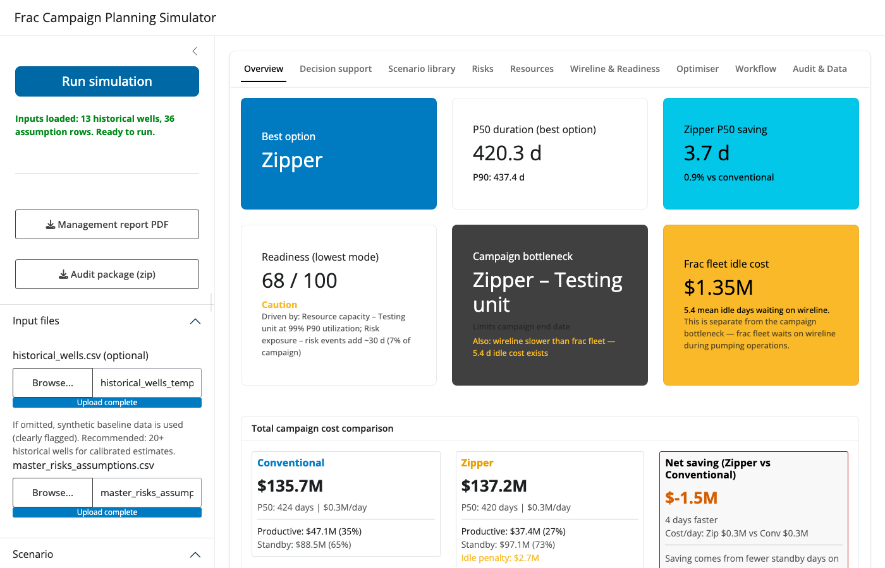

### Decision support — narrative, recommendation, robustness and scenario library
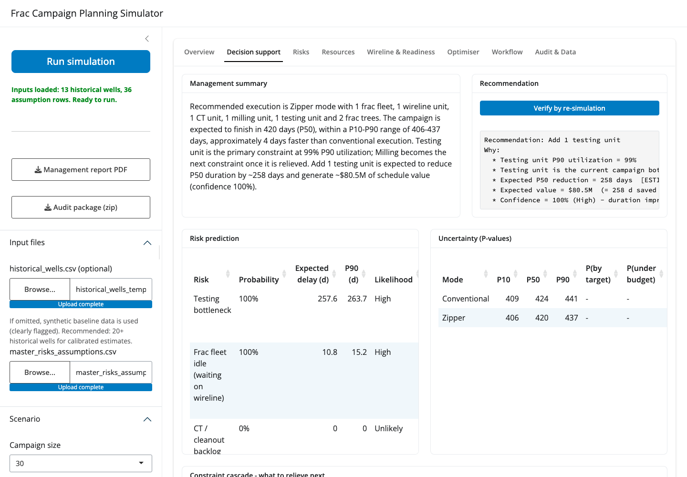

### Risks — schedule risk heatmap, well ranking, tornado and consequence propagation
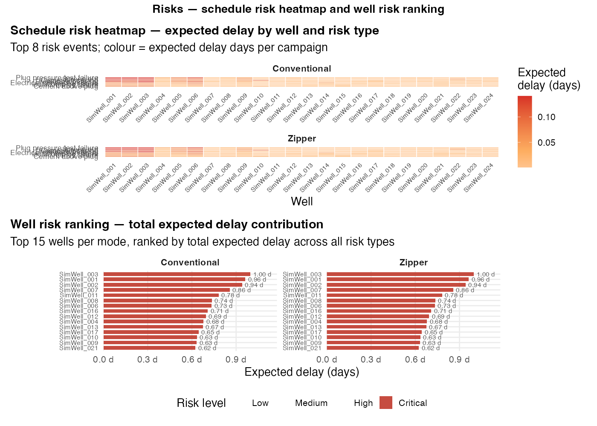

### Resources — utilization and deployment
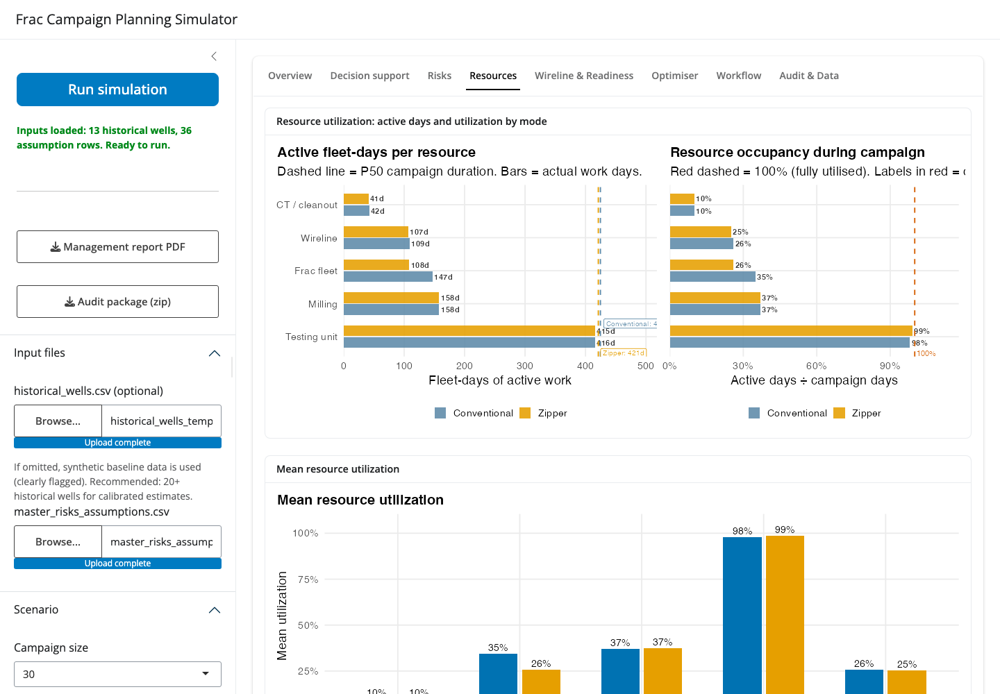

### Optimiser — constraint cascade and Pareto search
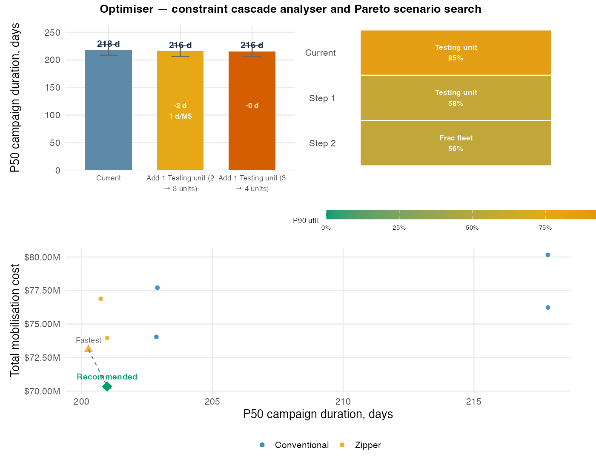

### Workflow — operational sequence viewer
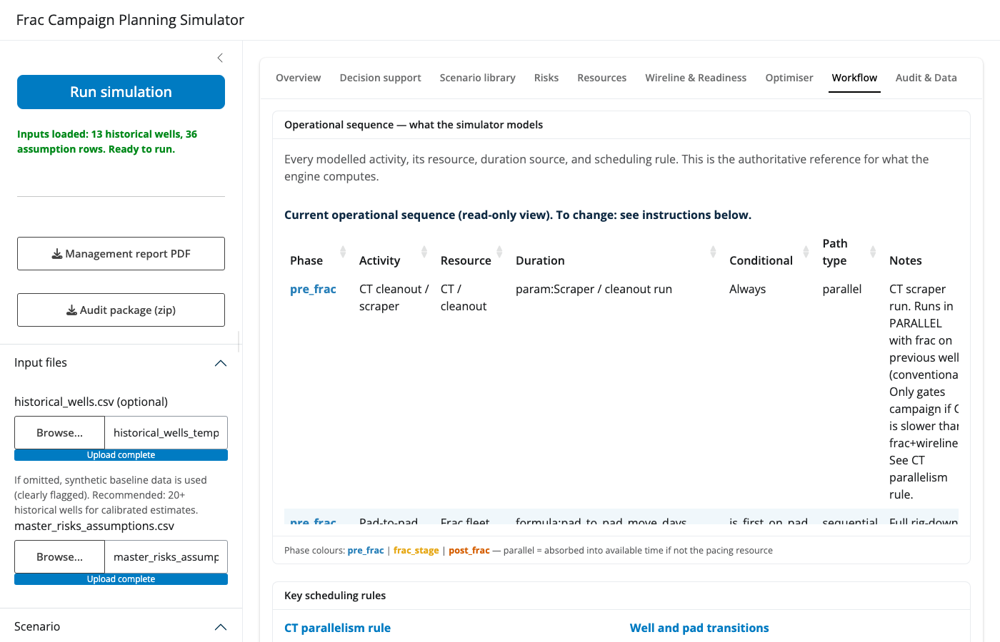

### Historical Learning — distribution fitting and assumption calibration
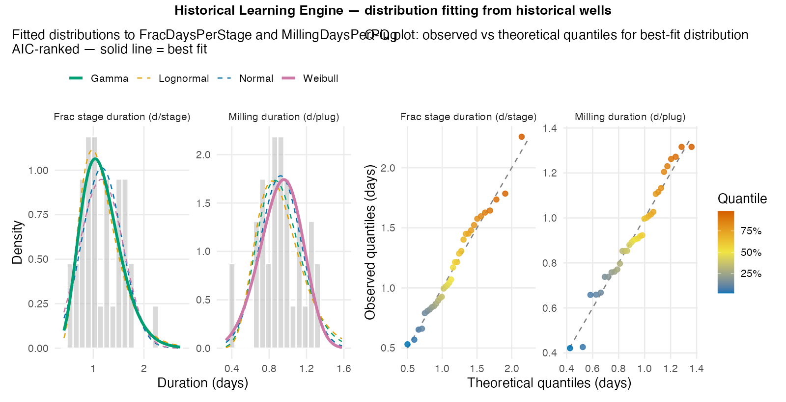

### Sensitivity Analysis — OAT tornado by planning variable
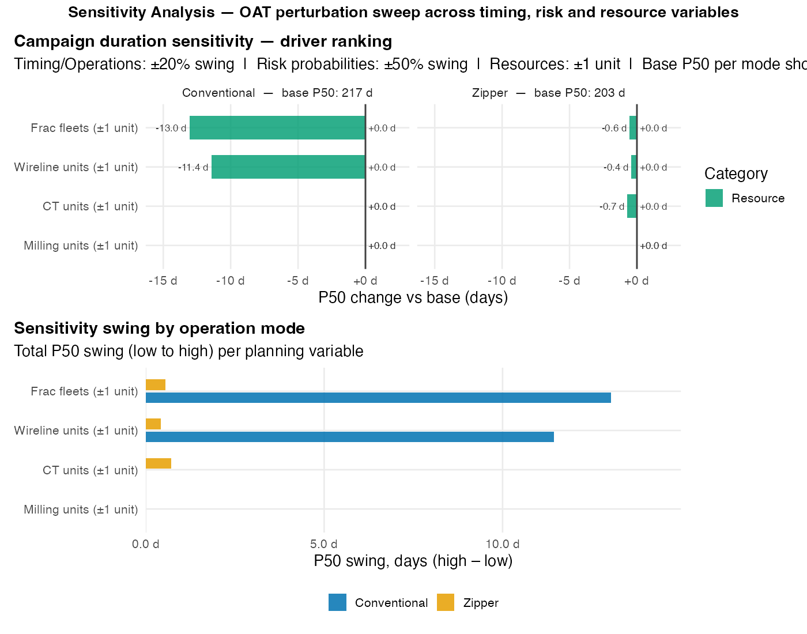

### Bayesian Update — prior vs posterior duration and risk probability update
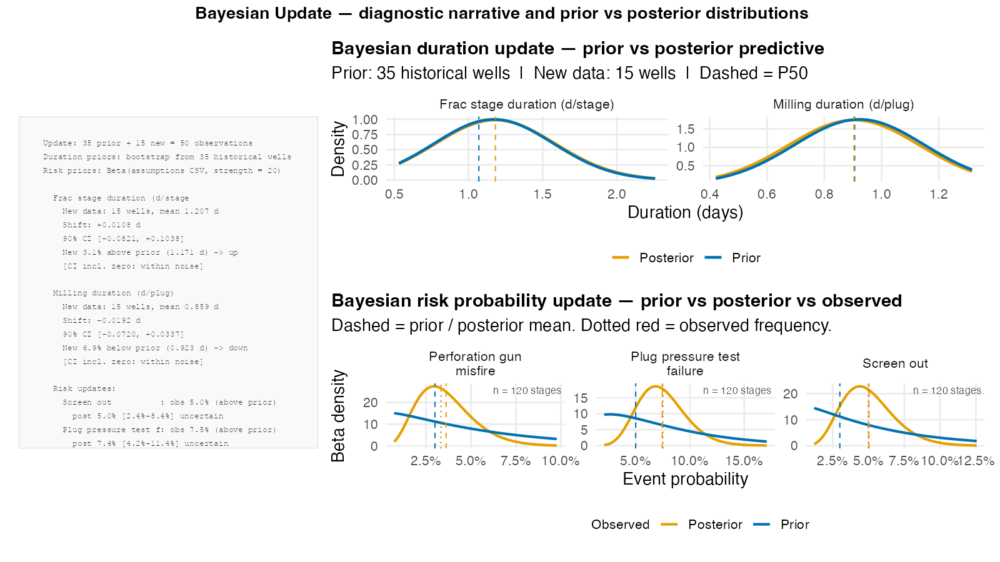

### What-If Builder — scenario variant comparison
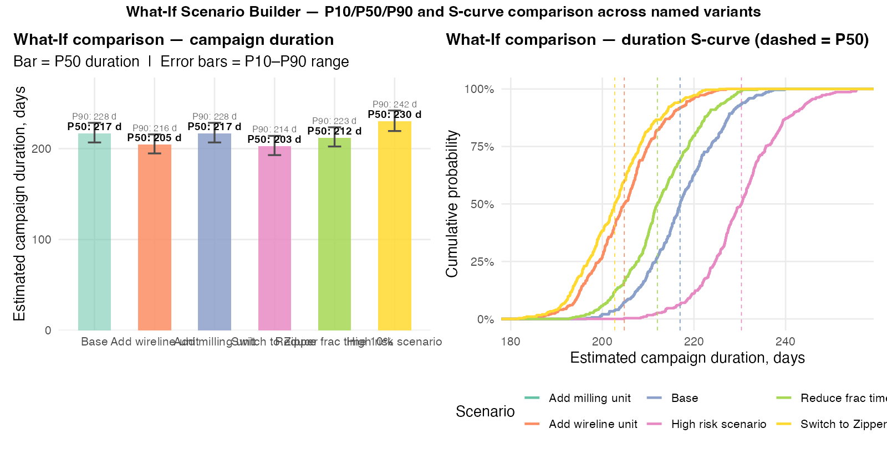

### Schedule Risk Heatmap — expected delay by well and risk type, well risk ranking
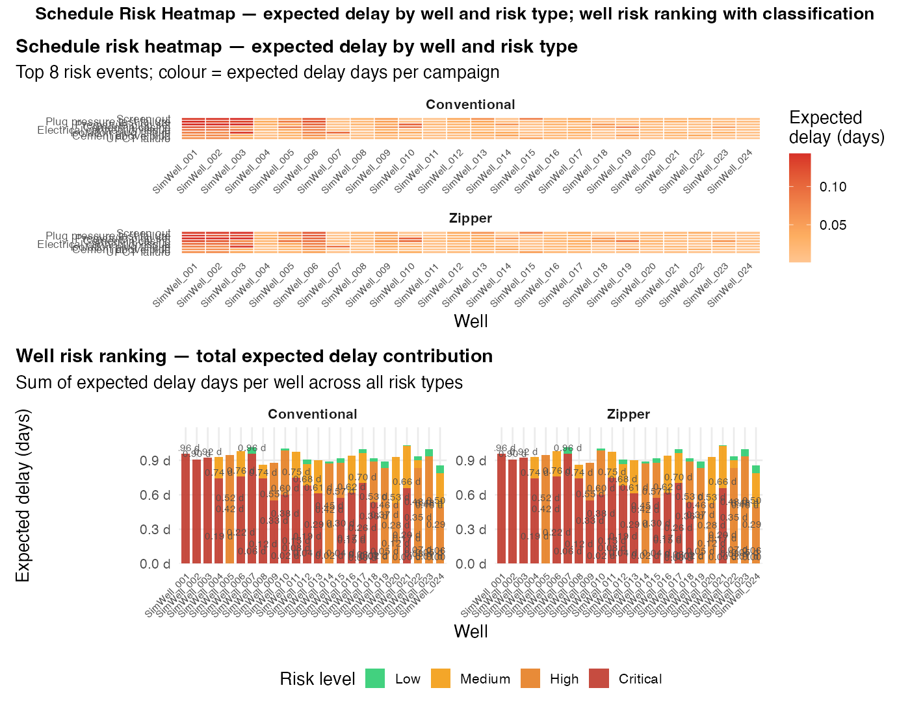

---

# Operational Logic

This section documents the modelled equipment relationships and operation sequence so the logic can be verified against, and adapted to, your own operations.

## Equipment Relationship Map

Key dependencies as modelled:

- **Wireline gates frac.** A stage cannot pump until wireline has perforated and set the plug. In zipper mode, if wireline workload per well exceeds frac workload per well, the frac fleet waits (`wireline_readiness_delay_days`) and the idle cost is reported.
- **CT cleanout runs in parallel with frac (conventional).** CT preps well N+1 during well N's frac execution. CT only gates the campaign if it becomes the pacing resource (i.e. CT workload per well > frac+wireline workload per well). See Conventional Frac Execution Logic below.
- **Cement evaluation runs offline when a spare wireline unit exists.** If `wireline_units >= 2`, cement evaluation is always run offline (spare unit available while primary unit perforates). With a single wireline unit, cement evaluation offline probability is set in the assumptions CSV (default 80%).
- **Frac trees gate zipper.** Zipper requires 2 trees minimum. With exactly 2, each inter-well transition incurs a swap delay; a 3rd tree reduces transition waiting (~5%), 4+ slightly more (~10%, diminishing).
- **Milling follows frac** and is scheduled discretely. Milling cannot start until a well is fully fraced AND a milling unit AND testing unit are both free. Wells are scheduled in frac-release order; later wells can begin milling while earlier wells are still in flowback.
- **CT / cleanout is separate from milling.** CT cleanout is pre-frac well intervention. Milling is post-frac plug drill-out on a dedicated milling spread. These are tracked as separate resources with separate utilization. Use "Allow CT to support milling" only if your CT unit genuinely does plug drill-outs.
- **Testing follows milling** per well. Each well's flowback + testing window starts when its milling completes AND a testing unit is free. The testing unit holds the resource during both milling (test confirmation) and flowback (pressure monitoring).

---

## Conventional Frac Execution Logic

```
CAMPAIGN PACING: Sequential well-by-well. One frac fleet, one wireline unit.

For each well (N = 1 to 30):
─────────────────────────────────────────────────────────────────────────
PRE-FRAC (CT / cleanout — runs in parallel with previous well's frac):
  CT cleanout / scraper run        ~0.5 d  (from assumptions CSV)
  Cement evaluation                ~1.0 d  (if running online; else 0)
  Note: CT preps well N during well N-1's frac execution.
        CT only delays campaign if ct_workload > (frac + wireline) per well.

FRAC STAGE LOOP (per stage, wireline then frac, sequential):
  Wireline: perforate stage N      time/stage (sidebar)
  Wireline: set isolation plug     isolation plug duration (CSV)
  [Optional: temperature log]      if this stage is a log stage
  Frac fleet: pump stage N         frac_time_per_stage (sidebar)
  Settling time                    settling hours (sidebar)
  → Repeat for all stages

POST-FRAC (milling + testing — run in parallel with ongoing frac on other wells):
  Milling unit: drill out plugs    plugs × milling_days_per_plug (historical)
  Testing unit: occupied during milling  (resource held, not additional time)
  Testing unit: flowback + well test     7–10 days (configurable, per well)
─────────────────────────────────────────────────────────────────────────

CAMPAIGN DURATION:
  Frac path  = Σ max(ct_per_well, frac_per_well + wireline_per_well) over all wells
  Post-frac  = discrete scheduler: wells flow into milling/testing queue
               as they are released; last well's flowback_finish = campaign end
  Campaign   = max(frac_path, post_frac_completion_day)

WHAT THIS MEANS IN PRACTICE:
  With typical values (frac 12h/stage, wireline 6h/stage, 6 stages/well):
    frac+wireline ≈ 4.5 d/well  >  ct_workload ≈ 1.6 d/well
    → CT completes within frac window; does NOT add to campaign time
    → Campaign paced by (frac + wireline) sequential path ≈ 4.5 d/well × 30 = 135 d
  Post-frac queue (milling + testing) runs concurrently; with 3+ testing units
  it clears before or alongside the frac path.
```

---

## Zipper Frac Execution Logic

```
CAMPAIGN PACING: Alternating wells on two simultaneous fracs.
Requires: ≥ 2 frac trees, ≥ 2 wells on pad (or adjacent pads).

For each pair of wells (A, B alternating):
─────────────────────────────────────────────────────────────────────────
PRE-FRAC (overlapped — both wells prepped before first stage):
  CT cleanout: Well A              ~0.5 d
  CT cleanout: Well B              ~0.5 d  (CT moves after Well A)
  Cement evaluation: well A + B (if online)
  Wireline: perforate Well A Stage 1

FRAC STAGE LOOP (alternating wells):
  ┌────────────────────────────────────────────────────────────┐
  │ Well A: FRAC Stage N              While: Wireline preps B  │
  │ Well B: FRAC Stage N              While: Wireline preps A  │
  │ → Frac fleet moves A → B → A, wireline stays 1 stage ahead│
  └────────────────────────────────────────────────────────────┘
  Frac fleet idle if wireline not ready → wireline_readiness_delay_days

  Tree swap: each A→B transition incurs swap_delay
    2 trees: full swap delay (sidebar: frac_tree_swap_delay_hours, default 4h)
    3 trees: 5% reduction in effective execution time
    4+ trees: 10% reduction (diminishing)

  Zipper execution factor applied to frac workload (default 0.75)
  → frac_execution = base_frac × 0.75 (25% faster than conventional)
─────────────────────────────────────────────────────────────────────────

CAMPAIGN DURATION:
  Per well:   frac_related = ct_fleet_days + max(frac_fleet_days, wireline_fleet_days)
              (wireline and frac run in parallel; whichever is slower governs)
  Frac path  = Σ frac_related over all wells
  Post-frac  = same discrete scheduler as conventional
  Campaign   = max(frac_path, post_frac_completion_day)

WHY ZIPPER IS FASTER:
  Conventional per well: frac + wireline in sequence  ≈ 4.5 d
  Zipper per well:       max(frac × 0.75, wireline)  ≈ max(3.4, 3.6) ≈ 3.6 d
  Campaign saving:       (4.5 - 3.6) × 30 = ~27 d (frac path alone)
  Additional saving:     post-frac queue shorter because wells release earlier
  Total P50 saving: typically 60–120 days for a 30-well campaign

WIRELINE CONSTRAINT:
  If wireline_days_per_well > frac_days_per_well × 0.75:
    Frac fleet waits on wireline → idle cost reported
  If wireline_days_per_well < frac_days_per_well × 0.75:
    Wireline waits between wells → no frac idle cost

FRAC TREE CONSTRAINT:
  2 trees: every A→B transition costs swap_delay_hours ÷ 24 per well
  3 trees: spare tree pre-positioned; swap delay reduced ~5%
  4+ trees: further reduction ~10% (diminishing returns)
```

---

## Risk Consequence Propagation

Risks do not just add delay days. Each technical risk cascades into induced resource workload:

Default consequence library (per occurred event, overridable per-risk via CSV):

| Risk event | Scope | Wireline runs | CT days | Milling plugs | Testing days | Pump days |
|---|---|---|---|---|---|---|
| Screenout | stage | 1 | 0.50 | - | - | 0.25 (+ extra stage) |
| Plug pressure test failure | stage | 1 | - | - | 0.15 (+ plug) | - |
| Premature plug set | stage | - | 0.25 | - | 0.30 | - |
| Perforation / gun misfire | stage | 1 | - | - | - | - |
| Isolation plug failure | stage | 1 | 0.50 | 1 | 0.25 | - |
| UPCT failure | stage | 1 | 0.25 | - | - | - |
| Cement in casing | stage | - | 1.00 | - | - | - |
| Cement above plug | stage | - | 0.50 | - | - | - |
| Wireline crew unavailable | campaign | - | - | - | - | - |
| CT unit unavailable | campaign | - | - | - | - | - |
| Weather / permit / access | campaign | - | - | - | - | - |

**Risk scope** controls how probability is applied:
- `stage`: probability per stage. Effective per-well probability = `1 - (1-p)^N_stages`. Use for events that can occur on any individual stage (screenout, gun misfire).
- `well`: independent probability per well. Use for well-level events (surface equipment failure).
- `campaign`: single Bernoulli draw for the whole campaign. Use for crew absences, weather, permits — events that affect the whole operation, not each well independently. This prevents the structural error of treating a crew walkout as 30 independent per-well events.

---

## Campaign Duration Formula

```
─── PER WELL ──────────────────────────────────────────────────────────────

wireline_workload = stages × time/stage
                  + wireline rig up/down
                  + temperature log days
                  + wireline contingency %
                  + risk delays (wireline-class)
                  + induced re-runs from consequences

frac_workload     = (stages × frac_time/stage
                  + frac settling time
                  + isolation plug duration
                  + risk delays (frac-class + external)
                  + induced pumping from consequences
                  + frac tree swap delays)
                  × zipper_efficiency_factor

ct_workload       = cleanout duration
                  + cement eval duration (if running online; 0 if offline)
                  + risk delays (CT-class)
                  + induced CT interventions from consequences

milling_workload  = plugs × milling_days_per_plug
                  + extra plugs from risk consequences

flowback_testing  = uniform(flowback_min, flowback_max) days
                  + induced testing days from consequences

─── PASS 1: FRAC PATH ─────────────────────────────────────────────────────

Conventional:
  frac_related_per_well = max(ct_workload, frac_workload + wireline_workload)
  [CT runs in parallel with frac on adjacent well; only gates campaign if CT
   is the pacing resource]

Zipper:
  frac_related_per_well = ct_workload + max(frac_workload, wireline_workload)
  [CT precedes each well; frac and wireline overlap across alternating wells]

frac_path_days = Σ frac_related_per_well over all wells

─── PASS 2: CT SPARE CAPACITY FOR MILLING (optional) ──────────────────────

total_ct_capacity      = frac_path_days × ct_units
ct_available_capacity  = max(total_ct_capacity - total_ct_primary_workload, 0)
ct_milling_support     = min(milling_demand, ct_available × efficiency)
adjusted_milling       = milling_demand - ct_milling_support

─── POST-FRAC DISCRETE SCHEDULER ─────────────────────────────────────────

Wells released from frac in campaign order (earliest first).
For each released well, allocate first available (milling_unit, testing_unit) pair.
Testing unit is held during both milling and flowback phases.
post_frac_completion = max(flowback_finish across all 30 wells)

─── CAMPAIGN DURATION ─────────────────────────────────────────────────────

campaign_days = max(frac_path_days, post_frac_completion)
```

---

## Adapting the Model to Your Operations

| Your operation differs in... | Adjust... | Where |
|---|---|---|
| Stage cycle times | Frac time per stage, wireline time per stage, settling time | Sidebar > Operation timing |
| No cement evaluation or scraper run | Set duration rows to 0 in assumptions CSV | `master_risks_assumptions.csv` |
| Cement evaluation always offline | Set Cement eval offline probability to 1.0 | `master_risks_assumptions.csv` |
| CT and milling are the same unit | Enable "Allow CT to support milling", set CT milling efficiency (0.65 default) | Sidebar > Resources |
| Different milling rate | Supply actual MillingDaysPerPlug values | `historical_wells.csv` |
| Risk likelihoods and delays | Probability / Min / ML / Max per risk | `master_risks_assumptions.csv` |
| Risk scope (per-stage vs per-well vs campaign-wide) | Scope column in assumptions CSV | `master_risks_assumptions.csv` |
| Risk operational consequences | Add consequence override columns | `master_risks_assumptions.csv` |
| Flowback duration | Flowback + testing min/max days | Sidebar > Resources |
| Tree swap handling | Frac tree swap delay hours; frac trees available | Sidebar > Resources |
| Different operation sequence | See Workflow tab in the app | Workflow tab |
| New resource type | Code change required: add to resource vectors and workload formula | `simulation_engine.R` |

---

# Architecture

```
Historical Wells CSV     Assumptions + Risk CSV     workflow_config.csv (opt.)
         │                        │                           │
         └────────────────────────┴───────────────────────────┘
                                  │
                                  ▼
          Input Validation (row-level diagnostics, scope check)
                                  │
                                  ▼
          Monte Carlo Simulation Engine
            │ parameter cache · static risk grid (vectorised)
            │ scope-aware risk probability (stage/well/campaign)
            │ consequence propagation (CT/wireline/milling/testing)
            │ CT cleanout parallel with frac path (conventional)
            │ cement eval offline rule (wireline unit count driven)
            │ two-pass CT capacity · discrete post-frac scheduler
                                  │
                                  ▼
    ┌─────────────┬─────────────┬──────────────┬─────────────┐
    │   Summary   │ Well Detail │  Risk Event  │  Resource   │
    │ (P10/50/90) │ Audit Trail │ Log + Conseq.│ Utilization │
    └─────────────┴─────────────┴──────────────┴─────────────┘
                                  │
                                  ▼
    Analytics: readiness · bottlenecks · investment ranking
               consequence summary · constraint cascade
               deployment timeline · Pareto optimiser
               schedule risk heatmap · sensitivity sweep
               Bayesian updater · learning engine · what-if builder
                                  │
                                  ▼
    Decision layer: traceable recommendations · bottleneck
                    explainability · risk prediction
                    uncertainty (P-values) · management narrative
                                  │
                                  ▼
    ┌──────────┬──────────┬──────────┬────────────┬──────────┬──────────┐
    │Dashboard │ Decision │Optimiser │ PDF Report │Audit Pkg │ Workflow │
    │ (bslib)  │ Support  │(Cascade+ │(executive+ │(zip 18+  │  Viewer  │
    │          │   Tab    │ Pareto)  │decision pg)│  CSV)    │          │
    └──────────┴──────────┴──────────┴────────────┴──────────┴──────────┘
```

---

# Application Guide

| Tab | Contents |
|---|---|
| **Overview** | KPI value boxes (best option, P50/P90, zipper saving, readiness + drivers, bottleneck, idle cost), investment ranking, S-curve, distribution, traffic lights |
| **Decision support** | Management summary narrative, recommendation panel with "Verify by re-simulation", risk prediction table, uncertainty (P-values) table, constraint-relief cascade, robustness check, sensitivity tornado, scenario library |
| **Historical Learning** | Automatic distribution fitting (Normal / Lognormal / Gamma / Weibull) to FracDaysPerStage and MillingDaysPerPlug; AIC/BIC/KS ranking; density overlay; Q-Q plot; suggested assumptions table |
| **Sensitivity** | OAT ±20% sweep (timing, scalars), ±50% (risk probabilities), ±1 unit (resources); tornado ranked by P50 swing; Conventional vs Zipper mode comparison grouped bar |
| **Bayesian Update** | Upload new completed-well observations; Normal-Normal conjugate duration update with prior vs posterior density overlay; Beta-Binomial risk probability update; merged dataset fed back to next simulation |
| **What-If** | Define named variants (resource counts, timing, efficiency overrides); P10/P50/P90 bar chart with error bars; S-curve overlay; readiness and bottleneck per variant |
| **Risks** | Schedule risk heatmap (well × risk-event expected delay), well risk ranking and classification, tornado, consequence propagation (direct vs induced), top delay contributors, stage-level risks, detail tables |
| **Resources** | Deployment timeline (Gantt-style), utilization, bottleneck detection, recommended actions, cost impact |
| **Wireline & Readiness** | Stage-readiness constraint breakdown, readiness score |
| **Optimiser** | Constraint cascade (greedy sequential fix, ROI per step) + Pareto grid search |
| **Workflow** | Operational sequence viewer, instructions for adapting the model |
| **Audit & Data** | Input fidelity check, full results, well details, risk event log, assumptions used |

## Constraint Cascade Analyser

The cascade answers three questions in order:

1. **What limits you today?** Identifies the binding constraint (P90 utilization).
2. **What limits you after you fix it?** Adds one unit of the binding resource, re-runs, identifies the next constraint.
3. **Where should I spend the next dollar?** Reports days saved, incremental cost, schedule value (days saved × daily spread rate), and ROI (days per $1M invested) at each step.

## Scenario Optimiser

The grid-search optimiser answers: *which configuration delivers the lowest time at the lowest cost?*

- **Objective**: total mobilisation cost = all contracted units × day rate × P50 duration.
- **Method**: every configuration screened at reduced iterations with a **common random seed**; top 5 refined at 600 iterations.
- **Output**: Pareto frontier of duration vs cost; recommended scenario with one-click sidebar apply.

---

# Input Files

The application reads two required files and one optional file. Ready-to-use templates with embedded editing guides are in the `data_templates/` folder.

---

## historical_wells.csv — required

One row per completed well from your previous campaigns. Minimum 5 wells. The two right-hand columns are the only ones the simulation engine reads; all others are metadata kept for audit output.

| Column | Role | Notes |
|---|---|---|
| `WellID` | Metadata | Any unique identifier (text) |
| `PadID` | Metadata | Pad name or number (text) |
| `StagesPlanned` | Metadata | Stages originally planned |
| `StagesCompleted` | Used by engine | Stages actually pumped to design |
| `PlugsInstalled` | Used by engine | Total isolation plugs set |
| `ContingencyPlugs` | Used by engine | Extra plugs set due to failures (0 if none) |
| `FracDays` | Metadata | Total pumping days for this well |
| `CementEvalDays` | Metadata | CT/wireline time for cement evaluation |
| `MillingDays` | Metadata | Total milling days for this well |
| **`FracDaysPerStage`** | **KEY — simulation input** | `= FracDays / StagesCompleted` — compute carefully |
| **`MillingDaysPerPlug`** | **KEY — simulation input** | `= MillingDays / PlugsInstalled` — include contingency plugs |

**Example rows:**

```
WellID,PadID,StagesPlanned,StagesCompleted,PlugsInstalled,ContingencyPlugs,FracDays,CementEvalDays,MillingDays,FracDaysPerStage,MillingDaysPerPlug
W-001, Pad_A,6,            6,              5,             0,               11.6,    1.0,           3.4,        1.93,            0.68
W-002, Pad_A,6,            6,              5,             0,               12.0,    0.8,           3.5,        2.00,            0.70
W-003, Pad_B,7,            7,              6,             0,               13.5,    0.9,           4.1,        1.93,            0.68
W-004, Pad_C,6,            6,              5,             0,               6.2,     0.5,           2.0,        1.03,            0.40   ← fast well
W-005, Pad_D,6,            6,              5,             0,               55.5,    2.1,           7.5,        9.25,            1.50   ← slow well/screenout
```

The engine bootstrap-resamples `FracDaysPerStage` and `MillingDaysPerPlug` to build duration distributions. Include outliers — they represent real uncertainty.

---

## master_risks_assumptions.csv — required

Contains two types of rows. **Read the header comments before editing.**

### Locked-name rows (Campaign Setup + Base Operation)
The engine looks these up by exact name. Do **not** rename them. Only change the numeric values.

| Category | Variable / Risk Event | Type | Editable values |
|---|---|---|---|
| Campaign Setup | Wells per pad | Random input | Min / Most Likely / Max |
| Campaign Setup | Stages per well | Random input | Min / Most Likely / Max |
| Campaign Setup | Temperature log stages | Random input | Min / Most Likely / Max |
| Campaign Setup | Cement eval offline | Random input | Probability (0–1) |
| Base Operation | Cement eval duration | Duration | Min / ML / Max Days |
| Base Operation | Scraper / cleanout run | Duration | Min / ML / Max Days |
| Base Operation | Frac days per stage | Historical | Reference only — engine resamples from CSV |
| Base Operation | Milling days per plug | Historical | Reference only — engine resamples from CSV |

### Free rows (Technical Risk / Resource Risk / External Risk)
Risk rows are processed generically — names are for display only. Rename, add, or remove freely.

| Column | What it controls |
|---|---|
| `Probability` | 0–1. Stage-scope: probability per stage. Campaign-scope: probability for the whole campaign. |
| `Min Days / Most Likely Days / Max Days` | Triangular distribution for the delay when the event occurs. |
| `Scope` | `stage`, `well`, or `campaign` — controls how probability is applied |
| `extra_wireline_runs` | Additional wireline trips triggered by this event (optional override) |
| `extra_ct_days` | Additional CT unit-days (optional override) |
| `extra_milling_plugs` | Additional plugs to mill (optional override) |
| `extra_testing_days` | Additional testing unit-days (optional override) |
| `extra_frac_days` | Additional pumping time (optional override) |

**Example rows (first few columns shown):**

```
Category,      Variable / Risk Event,    Type,        Probability,Min Days,Most Likely Days,Max Days,...,Scope
Campaign Setup,Wells per pad,            Random input,N/A,        3,       5,               6,       ...,
Base Operation,Cement eval duration,     Duration,    N/A,        0.5,     1.0,             2.0,     ...,
Technical Risk,Screen out,               Risk,        0.03,       0.25,    0.50,            2.0,     ...,stage
Resource Risk, Wireline crew unavailable,Risk,        0.08,       0.50,    1.0,             2.0,     ...,campaign
External Risk, Weather delay,            Risk,        0.05,       0.25,    1.0,             4.0,     ...,campaign
```

---

## workflow_config.csv — optional

Override the operational sequence without editing R code. If this file is absent, the engine uses the built-in plug-and-perf sequence automatically.

Each row is one activity. Row order within each phase controls execution order.

| Column | Editable? | Notes |
|---|---|---|
| `activity` | Free text | Short name, must be unique within the file |
| `phase` | Locked values | `pre_frac`, `frac_stage`, or `post_frac` |
| `resource` | Locked values | `Frac fleet`, `Wireline`, `CT / cleanout`, `Milling`, `Testing unit` |
| `duration_source` | Syntax locked | `param:<name>`, `formula:<expr>`, or `historical` |
| `conditional` | Locked values or blank | `!cement_eval_offline`, `temp_log`, `is_zipper`, `is_first_on_pad`, `!is_first_on_pad` |
| `path_type` | Locked values | `sequential` (extends schedule) or `parallel` (absorbed if spare capacity) |
| `notes` | Free text | Description shown in the Workflow tab |

**Example rows:**

```
activity,             phase,     resource,     duration_source,                         conditional,         path_type, notes
CT cleanout / scraper,pre_frac,  CT / cleanout,param:Scraper / cleanout run,            ,                    parallel,  ...
Cement evaluation,    pre_frac,  CT / cleanout,param:Cement eval duration,              !cement_eval_offline,parallel,  ...
Pump stage,           frac_stage,Frac fleet,   formula:frac_time_per_stage,             ,                    sequential,...
Mill out plugs,       post_frac, Milling,      formula:n_plugs * milling_days_per_plug, ,                    sequential,...
Flowback + well test, post_frac, Testing unit, formula:flowback_days,                   ,                    sequential,...
```

To add a new activity, copy any row of the same phase, paste at the end of that phase section, and edit. To disable an activity without removing it, set its duration to 0 in `master_risks_assumptions.csv`.

---

# Outputs

Audit package (zip): simulation_summary, simulation_well_details, simulation_risk_event_log (with consequence columns), resource_utilization, resource_utilization_summary, assumptions_used, executive_summary, executive_kpis, delay_contributors, stage_level_risks, risk_consequences, bottleneck_detection, resource_recommendations, investment_ranking, cost_impact, wireline_constraint, traffic_lights, readiness_score, resource_timeline, management_report.pdf.

Optimiser results and constraint cascade results export separately from the Optimiser tab.

---

# Run Locally

## Requirements
- R 4.3+

## Install Dependencies

```r
install.packages(c(
  "shiny", "bslib",
  "dplyr", "tidyr", "stringr", "tibble", "readr",
  "ggplot2", "scales",
  "DT", "janitor",
  "MASS",        # distribution fitting (learning engine)
  "gridExtra",   # executive PDF report
  "zip"          # robust cross-platform audit package
))
```

## Launch

```r
source("run_local.R")
```

---

# Roadmap

## Version 1.0 — MVP Simulator (Completed)
Monte Carlo engine, historical duration extraction, risk framework, conventional + zipper simulation, resource inputs, audit package.

## Version 2.0 — Operational Realism (Completed)
- Stage-level risk attribution with consequence propagation
- Risk scope calibration (stage / well / campaign)
- Frac tree constraints (swap delays, 3-tree and 4-tree bonus)
- Separate CT / cleanout and milling resources
- CT-supports-milling with discrete capacity transfer
- Testing unit with post-frac flowback discrete scheduler
- CT cleanout parallelism (conventional): CT runs in parallel with frac; only gates campaign if CT is the pacing resource
- Cement evaluation offline rule driven by wireline unit count
- Constraint cascade analyser (greedy sequential bottleneck resolution, ROI per step)
- Scenario optimiser (Pareto frontier, common random numbers, one-click apply)
- Executive PDF report (branded landscape, KPI dashboard, deployment timeline)
- Workflow viewer and sequence documentation
- Config-driven resource classification and consequence library
- Strict numeric validation with row-level error messages

## Version 2.5 — Decision Support Layer (Completed)
- Traceable recommendation engine with an evidence-based "why" panel and one-click "Verify by re-simulation"
- Bottleneck explainability: evidence chain (active work, utilization, queue-delay contribution) and a constraint-relief cascade ranked by recoverable days
- Risk prediction: per-risk probability, expected delay, and P90 delay, evaluable against a target completion date
- Uncertainty quantification: probability of finishing by a target date, staying within a budget ceiling, and resource overload risk
- Decision narrative engine generating a single management-readable summary paragraph
- New "Decision support" tab consolidating the above
- Executive decision summary page prepended to the PDF report
- Performance: bit-identical fast simulation engine and parallel scenario optimiser, keeping Standard/Audit modes and the grid-search optimiser responsive

## Version 3.0 — Analytics & Learning Layer (Completed)
- **Historical Learning Engine**: automated MLE distribution fitting to FracDaysPerStage and MillingDaysPerPlug; AIC/BIC/KS ranking; density overlay and Q-Q plot; suggested assumption table
- **Sensitivity Analysis Engine**: OAT perturbation sweep across all timing, risk probability, and resource variables; butterfly tornado chart; Conventional vs Zipper mode comparison
- **Bayesian Duration and Risk Updater**: Normal-Normal conjugate duration updating; Beta-Binomial risk probability updating; merged dataset flows into next simulation
- **What-If Scenario Builder**: batch variant comparison with P10/P50/P90, S-curve overlay, readiness and bottleneck per variant
- **Schedule Risk Heatmap**: well × risk-event expected delay tile chart; well risk ranking with Low/Medium/High/Critical classification; pad-level rollup

## Version 4.0 — Resource Scheduling Engine (Planned)
Discrete-event scheduling, true critical path, drilling programme integration, pad-to-pad resource movement, multi-fleet sequencing, schedule-accurate Gantt charts.

## Version 5.0 — Campaign Planning Platform (Planned)
Scenario management, historical campaign backtesting (predicted vs actual), portfolio-level planning.

---

# Limitations

- Operational planning model: workload-based aggregation. The post-frac milling/testing scheduler is discrete; the frac path and pre-frac scheduling are workload-based approximations.
- Not a hydraulic fracture propagation, reservoir, or production model.
- Risk consequences are deterministic per event (library defaults); delays are triangular-sampled.
- CT spare capacity assumes uniform availability over the campaign window (no within-campaign sequencing).
- Optimiser recommendations are conditional on the daily rates entered; sensitivity-check against contract values.
- Results depend on the quality of historical data and assumptions provided.
- Greedy cascade (constraint analyser) finds a locally optimal fix sequence; global optimum is the Pareto grid search.

---

# Development Approach

This project was developed using AI-assisted software development tools. Operational logic, engineering assumptions, simulation design, validation methodology, and decision-support workflows were designed and validated by the author based on 17+ years of completion and well intervention experience.

---

# License

MIT License. See the LICENSE file for details.

---

# Author

**Stephane Soulanoudjingar**

Senior Completions & Well Intervention Engineer with 17+ years of industry experience and MSc Data Science candidate.

This project combines operational domain expertise with data science techniques to support data-driven campaign planning and execution decision-making.
