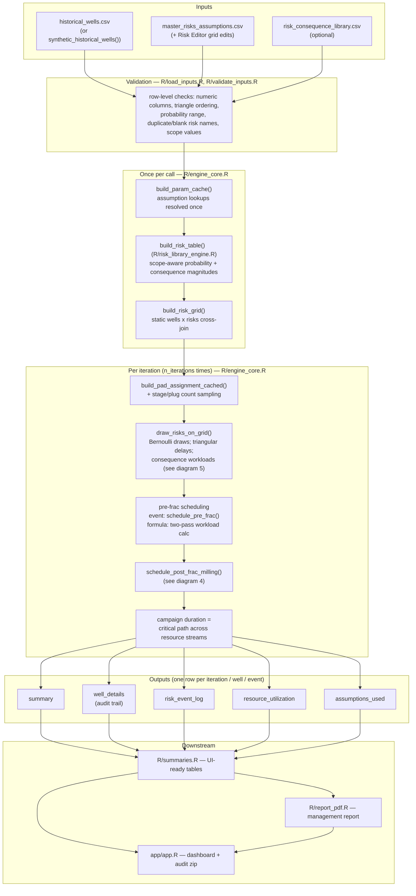
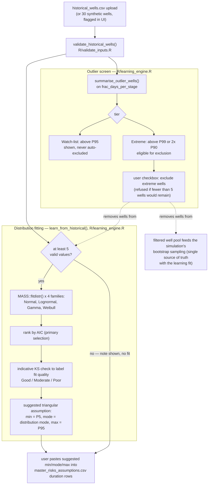
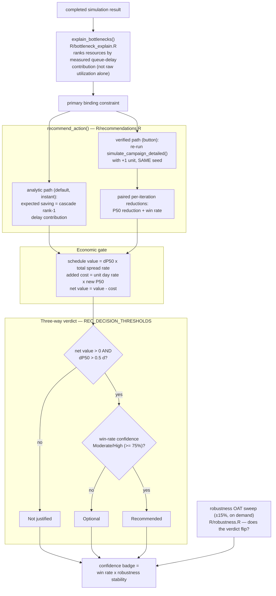
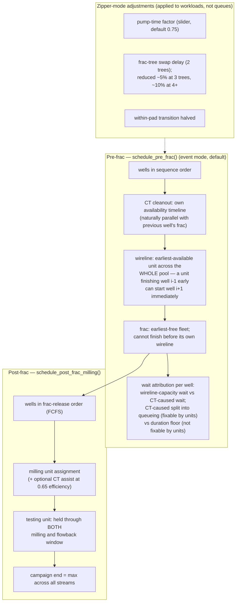
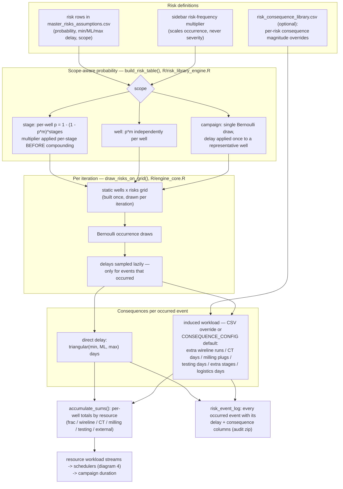

# Architecture — Subsystem Diagrams

Detailed diagrams for the five subsystems a reviewer most needs to understand.
Every box names the actual function and file it describes (post engine-split
layout: `R/engine_core.R` / `R/summaries.R` / `R/report_pdf.R` /
`R/optimiser_cascade.R` — see [`architecture_cleanup_plan.md`](architecture_cleanup_plan.md)
for how that split was made and verified). The top-level system diagram lives
in the [README's Architecture section](../README.md#architecture).

Diagrams are [Mermaid](https://mermaid.js.org/) — GitHub renders them inline,
and they diff like code, so they can be reviewed and kept current in the same
PRs that change the functions they describe.

---

## 1. Simulation pipeline

One `simulate_campaign_detailed()` call = one operation mode. "Compare both"
runs two calls with the **same seed** (common random numbers), so the
Conventional-vs-Zipper delta is a paired comparison, not two independent
samples.

The main "Run simulation" click executes this inside a `future::multisession`
worker (`app/app.R`) so the UI stays responsive; "Compare both" forks the two
mode calls across cores via `.par_lapply()` (`R/optimiser_parallel.R`),
bit-identical to sequential execution because every call seeds itself.

---

## 2. Historical learning pipeline

Runs automatically whenever the historical-wells data changes — no button.
Fitting is `MASS::fitdistr()` MLE; **AIC rank is the selection logic**, and
the KS p-value is an *indicative* check only (its parameters were fitted from
the same data being tested), which is why the UI wording never claims a
confirmed fit.

The Bayesian Update tab extends this pipeline: new completed wells update the
duration prior (Normal-conjugate) and observed risk counts update event
probabilities (Beta-Binomial), gated by `BAYES_DECISION_THRESHOLDS`
(`R/bayesian_updater.R`) before any planning number changes. "Apply" merges
the new wells into the same bootstrap pool.

---

## 3. Recommendation engine

The recommendation is *traceable*: the default answer is an instant analytic
estimate, but the "Verify by re-simulation" button re-runs the full Monte
Carlo with one extra unit of the binding resource at the **same seed** and
measures the actual paired improvement. Both paths end at the same
three-way verdict, driven entirely by `REC_DECISION_THRESHOLDS`
(`R/recommendations.R`) — the UI's "Decision Rules" disclosure reads those
constants live, so displayed rules cannot drift from the code.

The Overview tab's bottleneck card, the Decision Support tab's recommendation
panel, and the saved scenario records all read the **same** `rec_v2_r()`
object in `app/app.R` — one source of truth, so two tabs can never name
different bottlenecks for the same run.

---

## 4. Resource scheduler

Two schedulers, both in `R/engine_core.R`. The engine is a workload
aggregator, not a calendar-resolution discrete-event simulator — these model
resource *contention*, not stage-by-stage timing (see README Limitations).

The legacy "formula" mode (workload ÷ units, two-pass) is kept selectable in
the sidebar and is what `check_regression.R` uses to prove the fast engine
bit-identical to the archived original. The event scheduler's properties are
guarded by `R/test_schedule_pre_frac.R` (42 checks) and
`R/check_scheduling_modes.R` (physical lower bounds + monotonicity).

---

## 5. Risk propagation

Risks don't just add delay — technical risks cascade into *induced workload*
on specific resources, which then feeds the schedulers above. Scope is the
key calibration: treating a campaign-level event (e.g. crew unavailability)
as 30 independent per-well events is the classic error this design prevents.

The Risks tab's "Consequence propagation" chart splits each risk's total
impact into direct delay vs induced workload precisely because these are two
different mitigation conversations: the first is about the event itself, the
second about the resource that absorbs its aftermath.
